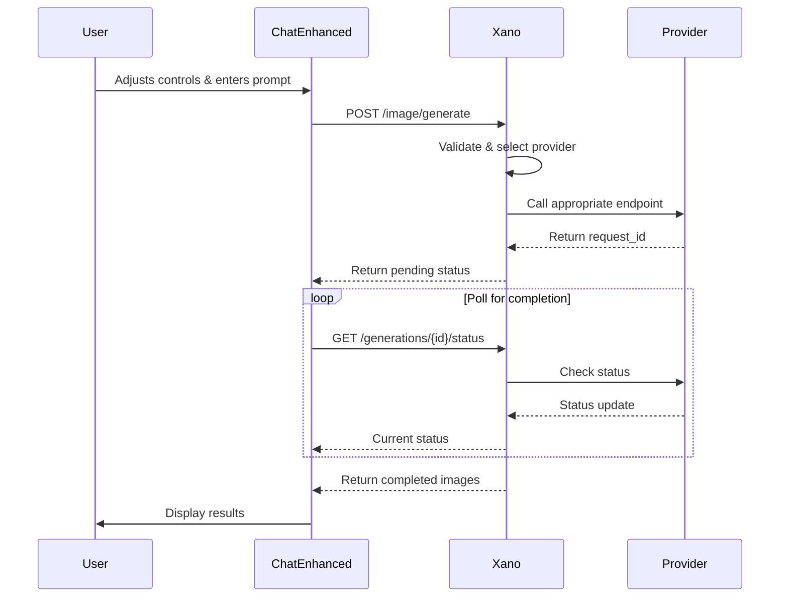

# ChatEnhanced ↔ Xano API Contract

## 🤝 Contract Overview

This document defines the official API contract between ChatEnhanced (frontend) and Xano Workspace 5 (backend) for AI image generation.

## 📋 Core Principle

**ChatEnhanced sends user intentions → Xano handles ALL complexity**

## 🔑 Primary Endpoint Contract

### Unified Image Generation
**Endpoint**: `POST https://xnwv-v1z6-dvnr.n7c.xano.io/api:_WUcacrv/image/generate`

#### Request Contract
```typescript
interface ImageGenerationRequest {
  // Required
  prompt: string;                    // User's image description
  
  // Generation Settings (all optional, Xano provides defaults)
  settings?: {
    cfg_scale?: number;             // 1.0-30.0, default: 7.5
    steps?: number;                 // 10-150, default: 30
    sampler?: string;               // "euler", "ddim", etc., default: "euler"
    seed?: number;                  // -1 for random, default: -1
    width?: number;                 // pixels, default: 1024
    height?: number;                // pixels, default: 1024
    negative_prompt?: string;       // what to avoid, default: ""
  };
  
  // LoRA Models (optional)
  loras?: Array<{
    id: number;                     // from lora_models table
    weight: number;                 // 0.0-2.0, default: 1.0
  }>;
  
  // Advanced Options (optional)
  options?: {
    provider?: "auto" | "fal" | "rundiffusion"; // default: "auto"
    num_images?: number;            // 1-8, default: 1
    format?: "jpeg" | "png" | "webp"; // default: "jpeg"
    quality?: number;               // 0-100, default: 95
    save_to_vault?: boolean;        // default: true
  };
}
```

#### Response Contract
```typescript
interface ImageGenerationResponse {
  // Always present
  request_id: string;               // Unique generation ID
  status: "pending" | "processing" | "completed" | "failed";
  
  // Present when status = "pending" or "processing"
  poll_url?: string;                // URL to check status
  estimated_time?: number;          // seconds until completion
  
  // Present when status = "completed"
  images?: Array<{
    url: string;                    // Public URL (temporary)
    vault_url: string;              // Xano vault URL (permanent)
    thumbnail_url?: string;         // Small preview
    metadata: {
      seed: number;                 // Actual seed used
      width: number;                // Actual dimensions
      height: number;
      generation_time: number;      // milliseconds
      provider: string;             // Which provider was used
    };
  }>;
  
  // Present when status = "failed"
  error?: {
    code: string;                   // Error code
    message: string;                // Human-readable message
    details?: any;                  // Debug information
  };
  
  // Always present
  credits_used: number;             // Cost of generation
  generation_id: number;            // Database record ID
}
```

## 📊 Supporting Endpoints

### 1. Get Available LoRAs
**Endpoint**: `GET https://xnwv-v1z6-dvnr.n7c.xano.io/api:_WUcacrv/loras/available`

#### Response
```typescript
interface LoRAModel {
  id: number;
  name: string;
  file_size_mb: number;
  type: string;
  personality: string;
  url: string;
  description: string;
  tags: string[];
  thumbnail_url?: string;
  usage_count: number;
  avg_weight: number;
}
```

### 2. Check Generation Status
**Endpoint**: `GET https://xnwv-v1z6-dvnr.n7c.xano.io/api:_WUcacrv/generations/{request_id}/status`

#### Response
Same as `ImageGenerationResponse`

### 3. Save Preset
**Endpoint**: `POST https://xnwv-v1z6-dvnr.n7c.xano.io/api:_WUcacrv/presets/save`

#### Request
```typescript
interface SavePresetRequest {
  name: string;
  settings: ImageGenerationRequest['settings'];
  loras: ImageGenerationRequest['loras'];
  tags?: string[];
}
```

### 4. Get Generation History
**Endpoint**: `GET https://xnwv-v1z6-dvnr.n7c.xano.io/api:_WUcacrv/generations/history`

#### Request Query Parameters
```
?page=1&per_page=20&date_from=2025-01-01&has_seed=true
```

## 🔄 Standard Flow



## ⚡ Quick Integration Example

```typescript
// In ChatEnhanced
class XanoImageService {
  private baseUrl = 'https://xnwv-v1z6-dvnr.n7c.xano.io/api:_WUcacrv';
  
  async generateImage(settings: GenerationSettings): Promise<ImageResult> {
    // 1. Format request according to contract
    const request: ImageGenerationRequest = {
      prompt: settings.prompt,
      settings: {
        cfg_scale: settings.cfg_scale,
        steps: settings.steps,
        sampler: settings.sampler,
        seed: settings.seed,
        width: settings.width,
        height: settings.height,
        negative_prompt: settings.negative_prompt,
      },
      loras: settings.lora_models.map(l => ({
        id: l.model.id,
        weight: l.weight
      })),
      options: {
        num_images: settings.batch_size || 1,
        format: 'jpeg',
        save_to_vault: true
      }
    };
    
    // 2. Send to Xano
    const response = await fetch(`${this.baseUrl}/image/generate`, {
      method: 'POST',
      headers: { 'Content-Type': 'application/json' },
      body: JSON.stringify(request)
    });
    
    const result: ImageGenerationResponse = await response.json();
    
    // 3. Handle based on status
    if (result.status === 'pending') {
      return this.pollForCompletion(result.request_id);
    } else if (result.status === 'completed') {
      return this.formatCompletedResult(result);
    } else {
      throw new Error(result.error?.message || 'Generation failed');
    }
  }
  
  private async pollForCompletion(requestId: string): Promise<ImageResult> {
    const maxAttempts = 60; // 60 seconds max
    let attempts = 0;
    
    while (attempts < maxAttempts) {
      const response = await fetch(
        `${this.baseUrl}/generations/${requestId}/status`
      );
      const result = await response.json();
      
      if (result.status === 'completed') {
        return this.formatCompletedResult(result);
      } else if (result.status === 'failed') {
        throw new Error(result.error?.message);
      }
      
      // Wait 1 second before next poll
      await new Promise(resolve => setTimeout(resolve, 1000));
      attempts++;
    }
    
    throw new Error('Generation timeout');
  }
}
```

## 🛡️ Error Handling

### Standard Error Codes
- `INVALID_LORA`: LoRA model ID not found
- `LIMIT_EXCEEDED`: Too many LoRAs or images requested
- `PROVIDER_ERROR`: Upstream provider failure
- `QUOTA_EXCEEDED`: User out of credits
- `VALIDATION_ERROR`: Invalid parameters

### Error Response Format
```json
{
  "error": {
    "code": "INVALID_LORA",
    "message": "LoRA model with ID 999 not found",
    "details": {
      "invalid_ids": [999],
      "valid_ids": [309, 310, 311, 312]
    }
  }
}
```

## 📈 Performance Guarantees

1. **Response Time**: Initial response < 500ms
2. **Polling Frequency**: 1 request/second maximum
3. **Image URLs**: Valid for 24 hours minimum
4. **Vault URLs**: Permanent storage
5. **Concurrent Requests**: 5 per user

## 🔐 Authentication

Currently using session-based auth. Future versions will support:
```
Authorization: Bearer {xano_auth_token}
```

## 📝 Version

**Current Version**: 1.0
**Last Updated**: January 15, 2025

Changes to this contract will be versioned and backwards compatible.