# Xano-Frontend Coordination Plan for ChatEnhanced

## Overview
This document outlines how ChatEnhanced frontend acts as a thin layer that coordinates with Xano workspace 5's powerful backend endpoints for AI image generation.

## 🎯 Key Principle
**ChatEnhanced = Thin UI Layer + Xano = Heavy Lifting Backend**

The frontend collects parameters and sends them to Xano, which handles all the complex logic, API integrations, and data management.

## 📡 Available Xano Endpoints Analysis

### Primary Image Generation Endpoints

#### 1. **black-forest-labs/flux-dev-lora** (ID: 2551)
**Most Recent & Feature-Rich**
```javascript
POST /api:_WUcacrv/black-forest-labs/flux-dev-lora
{
  prompt: string,
  model_name: string,      // LoRA model name
  modifier_name: string,   // Style modifier
  modifier_scale: decimal, // Weight for modifier
  image_size: string,      // Default: "square_hd"
  cfg: int,               // Default: 7
  num_images: int,        // Default: 1
  steps: int              // Default: 40
}
```

#### 2. **rundiffusion-fal/juggernaut-flux-lora** (ID: 1173)
**Advanced Multi-LoRA Support**
```javascript
POST /api:_WUcacrv/rundiffusion-fal/juggernaut-flux-lora
{
  prompt: string,
  loras: json,           // Array of LoRA configs (MAX 2)
  preset_name: string,   // Preset configurations
  num_inference_steps: int,    // Default: 40
  guidance_scale: decimal,     // Default: 3.5
  num_images: int,            // Default: 1
  image_size: string,         // Default: "portrait_4_3"
  enable_safety_checker: bool,
  output_format: string       // "jpeg" or "png"
}
```

#### 3. **fal-ai/flux-general** (ID: 1171)
**Most Flexible - Up to 5 LoRAs**
```javascript
POST /api:_WUcacrv/fal-ai/flux-general
{
  prompt: string,
  loras: json,              // Array (MAX 5 LoRAs!)
  num_inference_steps: int,  // Default: 40
  guidance_scale: decimal,   // Default: 3.5
  real_cfg_scale: decimal,   // Default: 3.5
  scheduler: string,         // Default: "euler"
  base_shift: decimal,       // Default: 0.5
  max_shift: decimal,        // Default: 1.15
  // ... more advanced params
}
```

### Supporting Endpoints

#### 4. **chatbot_bridge** (ID: 1225)
**For Chat Integration**
```javascript
POST /api:_WUcacrv/chatbot_bridge
{
  session_id: string,
  message: string,
  messages: json,    // Conversation history
  tools: json        // Available tools config
}
```

## 🔄 Frontend-Xano Data Flow

### 1. User Interaction Flow

```mermaid
graph LR
    A[User adjusts controls] --> B[Frontend collects params]
    B --> C[Format for Xano API]
    C --> D[Send to Xano endpoint]
    D --> E[Xano processes request]
    E --> F[Xano calls Fal.AI/Replicate]
    F --> G[Xano stores in DB]
    G --> H[Return URLs to frontend]
    H --> I[Display images]
```


### 2. Parameter Mapping

| Frontend Control | Xano Parameter | Endpoint Support |
|-----------------|----------------|------------------|
| CFG Scale | `cfg` or `guidance_scale` | All endpoints |
| Steps | `steps` or `num_inference_steps` | All endpoints |
| Sampler | `scheduler` | flux-general only |
| Seed | Not exposed | Need to add |
| Width/Height | `image_size` | All (preset-based) |
| LoRA Selection | `model_name` or `loras` array | All endpoints |
| LoRA Weight | `modifier_scale` or within `loras` | All endpoints |
| Negative Prompt | Not exposed | Need to add |
| Batch Size | `num_images` | All endpoints |

### 3. Image Size Presets (Xano Standard)
```javascript
const IMAGE_SIZES = {
  "square": "1024x1024",
  "square_hd": "1024x1024",
  "portrait_4_3": "768x1024",
  "portrait_16_9": "576x1024",
  "landscape_4_3": "1024x768",
  "landscape_16_9": "1024x576"
};
```

## 🎨 Frontend Components to Xano Integration

### 1. Enhanced Webhook Service
```typescript
// src/services/xanoWebhookService.ts
interface XanoImageRequest {
  endpoint: 'flux-dev-lora' | 'juggernaut-flux' | 'flux-general';
  params: {
    prompt: string;
    // Conditional params based on endpoint
    model_name?: string;        // For single LoRA
    loras?: Array<{            // For multi-LoRA
      url: string;
      scale: number;
    }>;
    cfg?: number;
    guidance_scale?: number;
    steps?: number;
    num_inference_steps?: number;
    image_size: string;
    num_images: number;
  };
}

export const generateImage = async (request: XanoImageRequest) => {
  const endpoint = getEndpointUrl(request.endpoint);
  const formattedParams = formatParamsForEndpoint(request);
  
  const response = await fetch(endpoint, {
    method: 'POST',
    headers: {
      'Content-Type': 'application/json',
    },
    body: JSON.stringify(formattedParams)
  });
  
  return response.json();
};
```

### 2. LoRA Integration with Xano Table 163
```typescript
// Fetch LoRAs from Xano
const fetchLoRAs = async () => {
  // Direct API call to browse table 163
  const response = await fetch(
    'https://xnwv-v1z6-dvnr.n7c.xano.io/api:database/table/163/records',
    {
      headers: {
        'Authorization': 'Bearer [token]'
      }
    }
  );
  return response.json();
};
```

### 3. Smart Endpoint Selection
```typescript
const selectBestEndpoint = (settings: GenerationSettings) => {
  const loraCount = settings.lora_models.length;
  
  if (loraCount === 0) {
    // Use basic flux-dev-lora with no LoRA
    return 'flux-dev-lora';
  } else if (loraCount <= 2) {
    // Use juggernaut for 1-2 LoRAs (best quality)
    return 'juggernaut-flux';
  } else {
    // Use flux-general for 3-5 LoRAs
    return 'flux-general';
  }
};
```

## 📊 Xano Backend Capabilities

### What Xano Handles:
1. **API Key Management** - Secure storage of Fal.AI, Replicate keys
2. **Request Queuing** - Handles async image generation
3. **Result Polling** - Checks generation status
4. **Image Storage** - Saves to Xano vault
5. **Database Tracking** - Records all generations
6. **Error Handling** - Retries and fallbacks
7. **Usage Analytics** - Tracks model usage
8. **Preset Management** - Saves successful combinations

### What Frontend Handles:
1. **Parameter Collection** - User-friendly controls
2. **Real-time Validation** - Input constraints
3. **Visual Feedback** - Loading states, progress
4. **Result Display** - Image gallery, downloads
5. **Settings Persistence** - Local storage
6. **Keyboard Shortcuts** - Power user features

## 🚀 Implementation Strategy

### Phase 1: Connect to Existing Endpoints
1. Update webhook service to call Xano endpoints
2. Map frontend controls to Xano parameters
3. Handle response formats (request_id for async)

### Phase 2: Enhance Xano Endpoints
1. Add seed parameter support
2. Add negative prompt support
3. Create unified response format
4. Add progress webhooks

### Phase 3: Advanced Features
1. Implement queue management UI
2. Add generation history from Xano
3. Create preset saving endpoint
4. Build analytics dashboard

## 🔧 Quick Integration Code

### Frontend WebhookPayload Update
```typescript
interface EnhancedWebhookPayload extends WebhookPayload {
  // Route to specific Xano endpoint
  xanoEndpoint: string;
  
  // Standard Xano params
  xanoParams: {
    prompt: string;
    model_name?: string;
    loras?: any[];
    cfg: number;
    steps: number;
    image_size: string;
    num_images: number;
  };
}
```

### Xano Endpoint Router
```javascript
// In your existing webhook handler
function routeToXanoEndpoint(payload) {
  const { xanoEndpoint, xanoParams } = payload;
  
  switch(xanoEndpoint) {
    case 'flux-dev-lora':
      return callFluxDevLora(xanoParams);
    case 'juggernaut-flux':
      return callJuggernautFlux(xanoParams);
    case 'flux-general':
      return callFluxGeneral(xanoParams);
    default:
      return { error: 'Unknown endpoint' };
  }
}
```

## 📝 Next Steps

1. **Test Existing Endpoints** - Verify parameter requirements
2. **Create Wrapper Endpoint** - Unified interface in Xano
3. **Add Missing Features** - Seed, negative prompts
4. **Build Progress System** - WebSocket or polling
5. **Implement Caching** - Reduce API calls

This coordination plan ensures ChatEnhanced remains a lightweight frontend while leveraging Xano's robust backend infrastructure for all heavy lifting!